# Сети в Linux

Настройка сетей в Linux на виртуальных машинах.

## Оглавление

1.  [Инструмент ipcalc](#part-1-инструмент-ipcalc)
2.  [Статическая маршрутизация между двумя машинами](#part-2-статическая-маршрутизация-между-двумя-машинами)
3.  [Утилита iperf3](#part-3-утилита-iperf3)
4.  [Сетевой экран](#part-4-сетевой-экран)
5.  [Статическая маршрутизация сети](#part-5-статическая-маршрутизация-сети)
6.  [Динамическая настройка IP с помощью DHCP](#part-6-динамическая-настройка-ip-с-помощью-dhcp)
7.  [NAT](#part-7-nat)
8.  [Дополнительно. Знакомство с SSH Tunnels](#part-8-дополнительно-знакомство-с-ssh-tunnels)

## Part 1. Инструмент ipcalc

Поднята машина ws1

### 1.1. Сети и маски

#### 1) Адрес сети

- Адрес сети 192.167.38.54/13 - 192.160.0.0/13

- Маска в двоичном виде: 11111111.11111000.00000000.00000000

- IP в двоичном виде: 11000000.10100111.00100110.00110110

- Операция AND: 11000000.10100000.00000000.00000000

- Адрес сети: 192.160.0.0/13

#### 2) Перевод маски

- Маска 255.255.255.0 - /24, 11111111.11111111.11111111.00000000

- Маска /15 - 255.254.0.0, 11111111.11111110.00000000.00000000

- Маска 11111111.11111111.11111111.11110000 - 255.255.255.240, /28

#### 3) Минимальный и максимальный хост в сети 12.167.38.4

- Маска /8 - 12.0.0.1 и 12.255.255.254

- Маска 11111111.11111111.00000000.00000000 - 12.167.0.1 и 12.167.255.254

- Маска 255.255.254.0 - 12.167.38.1 и 12.167.39.254

- Маска /4 - 0.0.0.1 и 15.255.255.254

### 1.2. localhost

- Сеть localhost - 127.0.0.0/8

- 194.34.23.100 - нельзя

- 127.0.0.2 - можно

- 127.1.0.1 - можно

- 128.0.0.1 - нельзя

### 1.3. Диапазоны и сегменты сетей

#### 1) Какие из перечисленных IP-адресов можно использовать в качестве публичных, а какие только в качестве частных

- Диапазоны для частных адресов: 10.0.0.0/8, 172.16.0.0/12, 192.168.0.0/16, 127.0.0.0/8

- 10.0.0.45 - частный

- 134.43.0.2 - публичный

- 192.168.4.2 - частный

- 172.20.250.4 - частный

- 172.0.2.1 - публичный

- 192.172.0.1 - публичный

- 172.68.0.2 - публичный

- 172.16.255.255 - частный

- 10.10.10.10 - частный

- 192.169.168.1 - публичный

#### 2) Какие из перечисленных IP-адресов шлюза возможны у сети 10.10.0.0/18

Необходимо проверить адреса на вхождение в диапазон адресов хостов

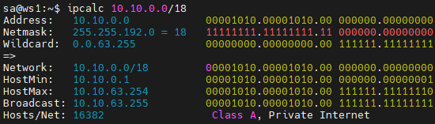  
*ipcalc*

- 10.0.0.1 - нет

- 10.10.0.2 - да

- 10.10.10.10 - да (*Обычно шлюз ставят на первый (.1) или последний (.254) адрес подсети)

- 10.10.100.1 - нет

- 10.10.1.255 - да

## Part 2. Статическая маршрутизация между двумя машинами

Вывод содержания измененного файла */etc/netplan/00-installer-config.yaml* для каждой машины:

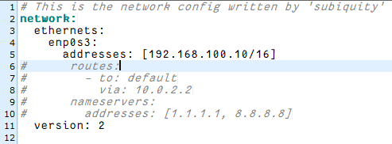  
*Машина ws1*

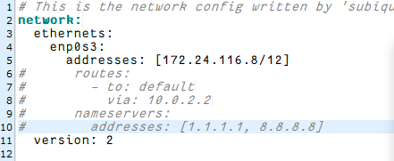  
*Машина ws2*

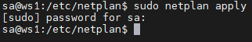  
*ws1 `netplan apply`*

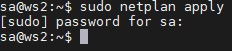  
*ws2 `netplan apply`*

### 2.1. Добавление статического маршрута вручную

Добавление статического маршрута командой `ip r add`:

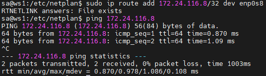  
*Пинг с машины ws1*

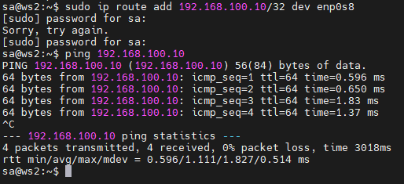  
*Пинг с машины ws2*

### 2.2. Добавление статического маршрута с сохранением

Добавим статический маршрут от одной машины до другой с помощью файла /etc/netplan/00-installer-config.yaml, применим изменения с помощью `netplan apply` и пропингуем соединение между машинами:

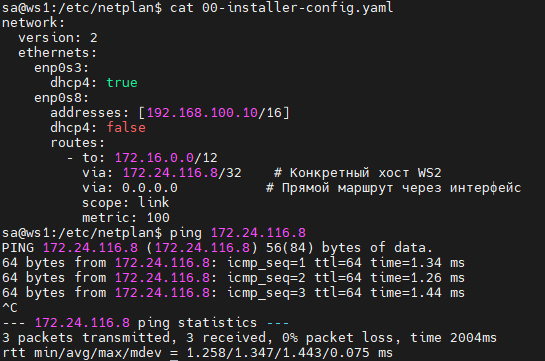  
*Машина ws1. Пинг с машины ws1*

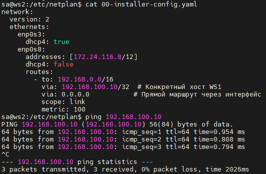  
*Машина ws2. Пинг с машины ws2*

## Part 3. Утилита iperf3

### 3.1. Скорость соединения

- 8 Мбит/с = x Мбайт/с * 8 бит/байт => x = 1 Мбайт/с

- 100 Мбайт/с = x кбит/с * 1/8 байт/бит * 10^3 => x = 8 * 10^5 кбит/с = 800 000 кбит/с

- 1 Гбит/с = x Мбит/с * 10^3 => 1000 Мбит/с

### 3.2. Утилита iperf3

Измерение скорости соединения между ws1 и ws2 с помощью `iperf3`

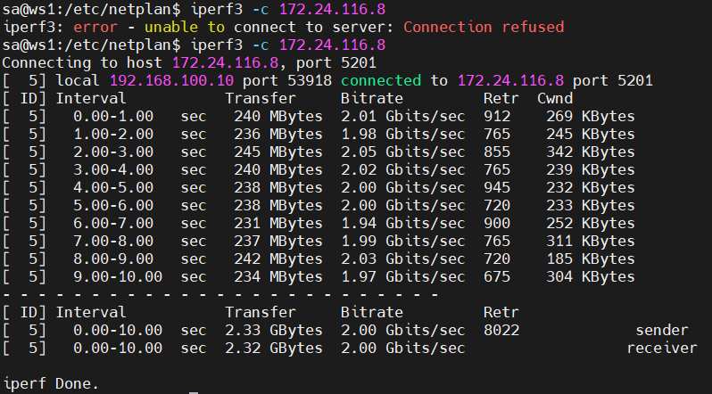  
*Измерение скорости от ws1*

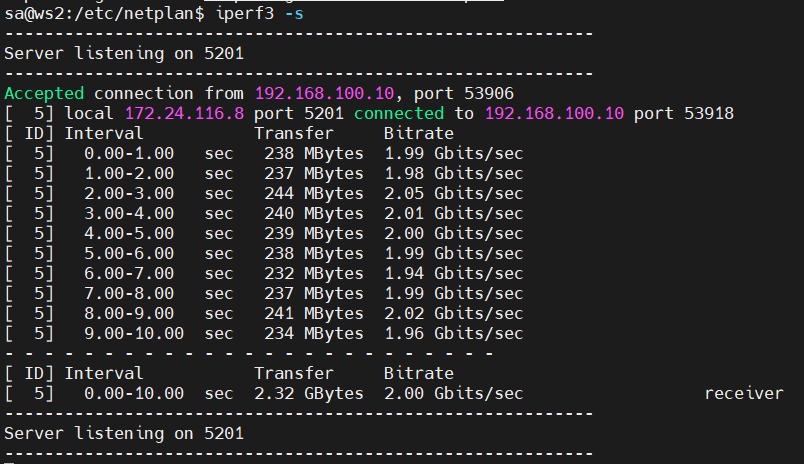  
*Измерение скорости от ws2*

## Part 4. Сетевой экран

### 4.1. Утилита iptables

Файлы, имитирующие фаервол:

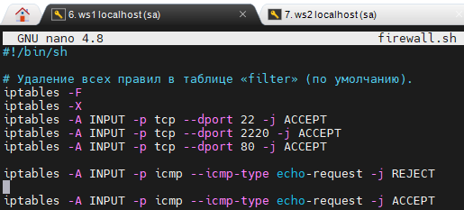  
*Скрипт, имитирующий фаервол, на ws1*

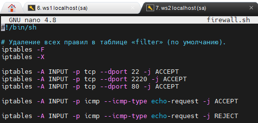  
*Скрипт, имитирующий фаервол, на ws2*

Вызов скриптов:

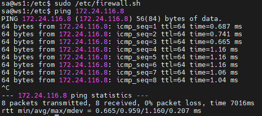  
*Запуск скрипта на ws1*

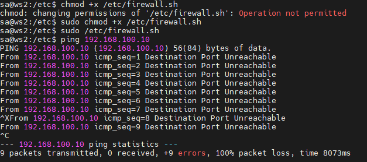  
*Запуск скрипта на ws2*

Правила выполняются сверху-вниз, следовательно, если правило запрета находится выше оно срабатывает, а правило разрешения находящиеся ниже - нет.

### 4.2. Утилита nmap

Вызов пинга и использование утилиты nmap:

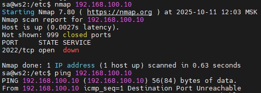  
*ping и nmap на ws2*

Объяснение разницы в стратегиях:

В iptables для одинаковых условий срабатывает ПЕРВОЕ СОВПАВШЕЕ ПРАВИЛО.

Последующие правила с такими же условиями, вопреки интуитивности, НЕ ОТМЕНЯЮТ ДЕЙСТВИЯ ПЕРВОГО ПРАВИЛА.

## Part 5. Статическая маршрутизация сети

  
*Cхема сети*

### 5.1. Настройка адресов машин

Содержание файла /etc/netplan/00-installer-config.yaml для каждой машины:

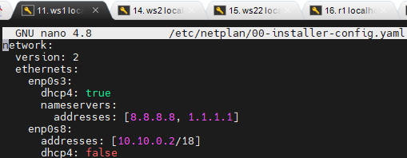  
*netplan config ws11*

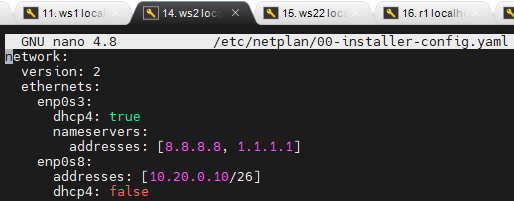  
*netplan config ws21*

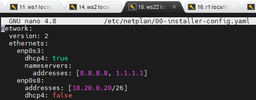  
*netplan config ws22*

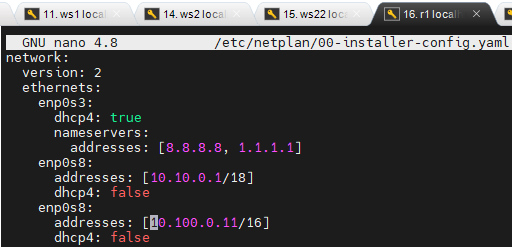  
*netplan config r1*

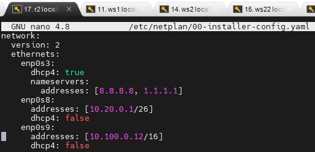  
*netplan config r2*

Проверка IP и пинг:

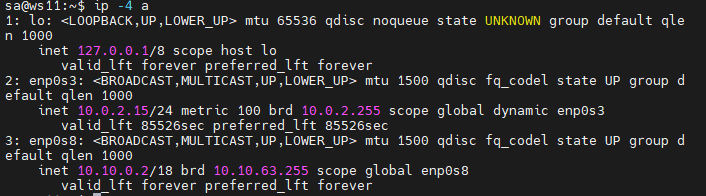  
*ip -4 a на ws11*

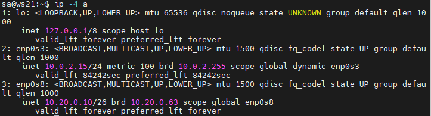  
*ip -4 a на ws21*

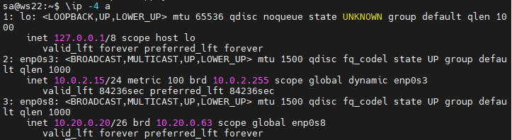  
*ip -4 a на ws22*

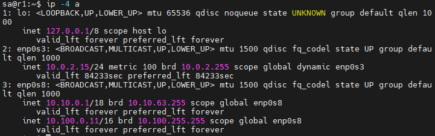  
*ip -4 a на r1*

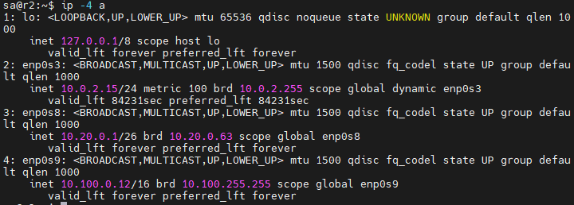  
*ip -4 a на r2*

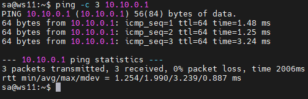  
*ping r1 на ws11*

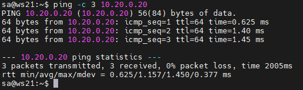  
*ping ws22 на ws21*

### 5.2. Включение переадресации IP-адресов

Включение переадресации IP на роутерах с помощью команды `sysctl -w net.ipv4.ip_forward=1`:

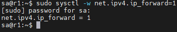  
*Переадресация на r1*

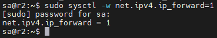  
*Переадресация на r2*

Файл */etc/sysctl.conf* с добавленной строкой `net.ipv4.ip_forward = 1`:

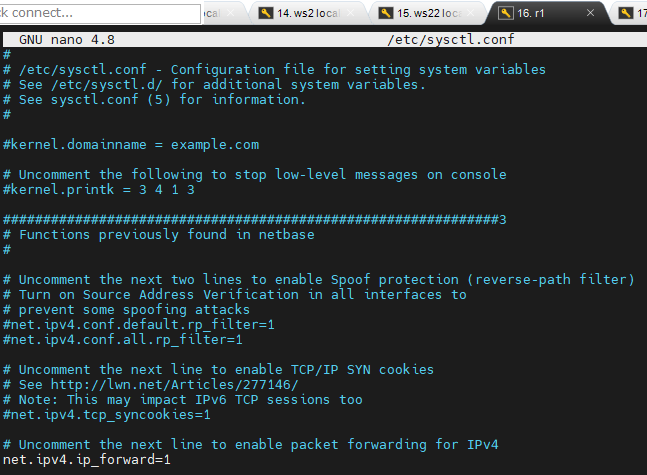  
*Переадресация на r1*

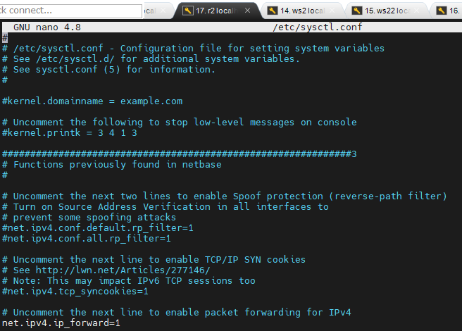  
*Переадресация на r2*

### 5.3. Установка маршрута по умолчанию

Установка шлюзов на рабочих станциях:

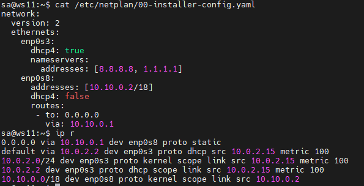  
*Шлюз на ws11. Вывод ip r*

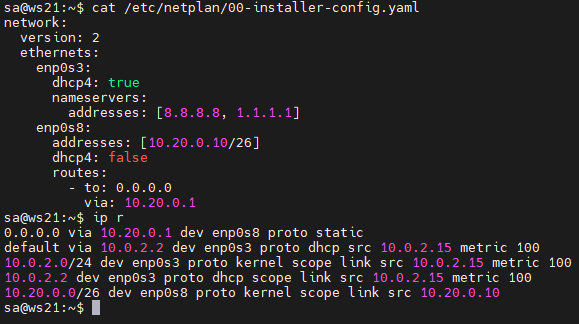  
*Шлюз на ws21. Вывод ip r*

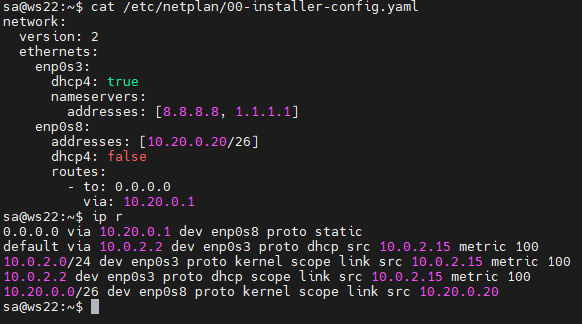  
*Шлюз на ws22. Вывод ip r*

Пропингуем с ws11 роутер r2 и покажем на r2, что пинг доходит с помощью команды `tcpdump -tn -i enp0s9`:

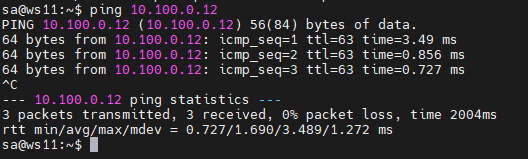  
*ping с ws11 до r2*

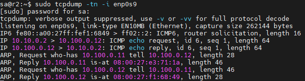  
*tcpdump на r2*

### 5.4. Добавление статических маршрутов

Добавим в роутеры r1 и r2 статические маршруты в файле конфигураций, перезапустим сервис сети и вызовем команду `ip r`:

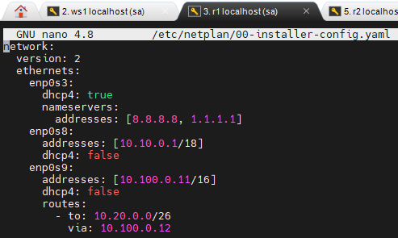  
*netplan с маршрутом на r1*

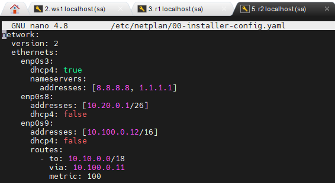  
*netplan с маршрутом на r2*

Команда `ip r`:

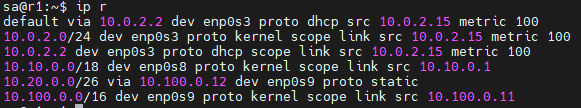  
*Маршруты на r1*

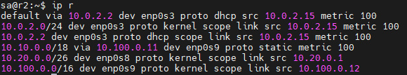  
*Маршруты на r2*

`ip r list` на ws11:

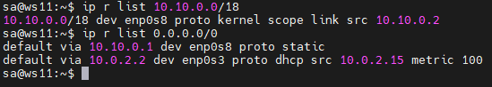  
*Список маршрутов на ws11 до 10.10.0.0/18 и 0.0.0.0/0*

Для 10.10.0.0/18 был выбран маршрут, отличный от 0.0.0.0/0, хотя он тоже подпадает под маршрут по умолчанию

Это объясняется тем, что маршрутизатор выбирает маршрут с самой длинной маской, то есть наиболее точный (специфичный) вариант с наибольшим количеством единиц в маске.

### 5.5. Построение списка маршрутизаторов

Запуск команды дампа *tcpdump* на r1 и построение списка маршрутизаторов на пути от ws11 до ws21 при помощи утилиты traceroute:

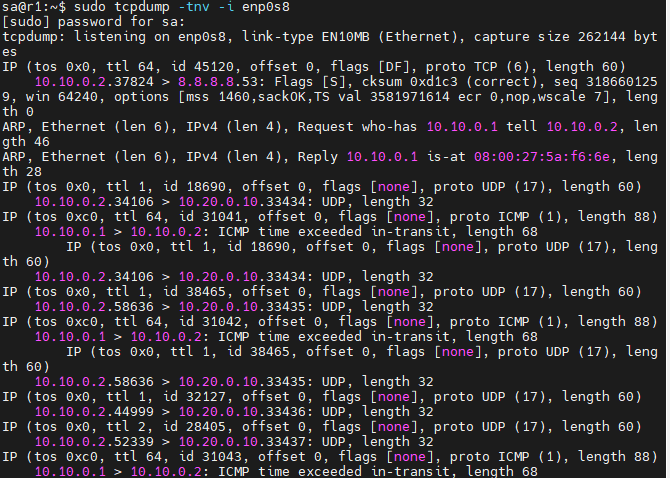  
*Вывод tcpdump на r1 после traceroute. На скриншот не влез вызов команды и первые записи*

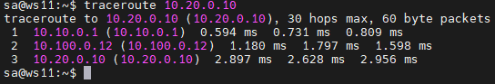  
*traceroute на ws11 до ws21*

Для определения промежуточных маршрутизаторов *traceroute* отправляет целевому узлу серию ICMP-пакетов (по умолчанию 3 пакета), с каждым шагом увеличивая значение поля TTL («время жизни») на 1. Это поле обычно указывает максимальное количество маршрутизаторов, которое может быть пройдено пакетом. Первая серия пакетов отправляется с TTL, равным 1, и поэтому первый же маршрутизатор возвращает обратно ICMP-сообщение «time exceeded in transit», указывающее на невозможность доставки данных. Traceroute фиксирует адрес маршрутизатора, а также время между отправкой пакета и получением ответа (эти сведения выводятся на монитор компьютера). Затем traceroute повторяет отправку серии пакетов, но уже с TTL, равным 2, что заставляет первый маршрутизатор уменьшить TTL пакетов на единицу и направить их ко второму маршрутизатору. Второй маршрутизатор, получив пакеты с TTL=1, так же возвращает «time exceeded in transit».

Процесс повторяется до тех пор, пока пакет не достигнет целевого узла. При получении ответа от этого узла процесс трассировки считается завершённым.

На оконечном хосте IP-датаграмма с TTL = 1 не отбрасывается и не вызывает ICMP-сообщения типа срок истёк, а должна быть отдана приложению. Достижение пункта назначения определяется следующим образом: отсылаемые traceroute пакеты содержат UDP-пакет с неиспользуемым портом на адресуемом хосте. Номер порта будет равен 33434 + (максимальное количество транзитных участков до узла) — 1. В пункте назначения UDP-модуль, получая подобные пакеты, возвращает ICMP-сообщения об ошибке «порт недоступен». Таким образом, чтобы узнать о завершении работы, программе traceroute достаточно обнаружить, что поступило ICMP-сообщение об ошибке этого типа

### 5.6. Использование протокола ICMP при маршрутизации

Запуск на r1 перехвата сетевого трафика, проходящего через enp0s8 с помощью команды `tcpdump -n -i enp0s8 icmp` и пинг с ws11 несуществующего IP `ping -c 1 10.30.0.111`:

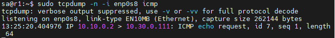  
*tcpdump после пинга на r1*

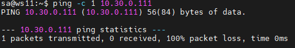  
*Пинг несуществующего адреса на ws11*

## Part 6. Динамическая настройка IP с помощью DHCP

Содержание файла */etc/dhcp/dhcpd.conf* для r2 с конфигурацией службы **DHCP**:

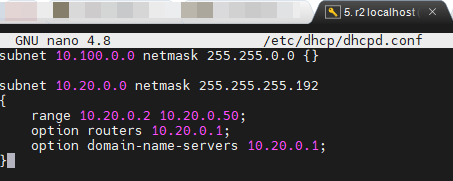  
*dhcpd.conf на r2*

Публичный DNS-сервер google `8.8.8.8` в *resolv.conf*

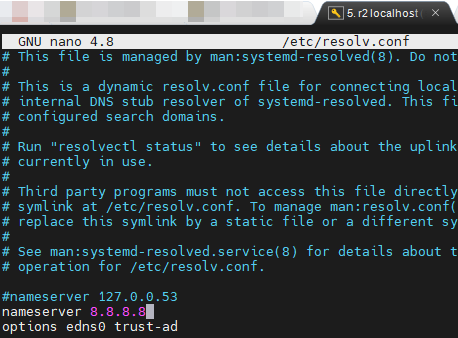  
*resolv.conf на r2*

Перезагрузка службы **DHCP** командой `systemctl restart isc-dhcp-server`:

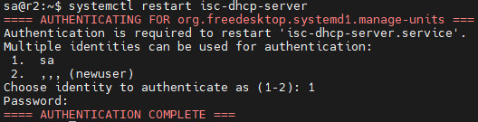  
*Перезагрузка DHCP на r2*

Перезагружаем машину ws21 при помощи `reboot` и через `ip a` покажем, что она получила адрес:

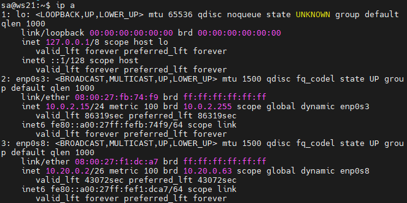  
*Новый адрес от DHCP-сервера на машине ws21 10.20.0.2*

Пинг с ws21 до ws22:

  
*Успешный пинг*

Cодержание файла */etc/netplan/00-installer-config.yaml* для ws11 с добавленным MAC адресом:

  
*Новый MAC-адрес в netplan ws11*

Аналогичная настройка службы **DHCP** на r1 (с жесткой привязкой к MAC адресу):

  
*Конфигурация DHCP: dhcpd.conf на r1*

  
*DNS: resolv.conf на r1*

  
*Перезагрузка DHCP на r1*

Проверка полученного IP на ws11: до перезагрузки:

  
*IP на ws11 до перезагрузки*

... и после:

  
*IP на ws11 после перезагрузки*

Проверка пинга с ws11 до ws22:

  
*Успешный пинг*

- Опции DHCP-сервера:

- range - диапазон адресов

- option routers - шлюз по умолчанию

- option domain-name-servers - DNS-серверы

- host - статическое сопоставление MAC-адреса и IP-адреса

## Part 7. NAT

Изменение конфигурации веб-сервера Apache2 на ws22 и r1:

  
*Конфигурация Apache2 на ws22*

  
*Конфигурация Apache2 на r1*

  
*Запуск Apache2 на ws22*

  
*Запуск Apache2 на r1*

Имитация фаервола на r2:

  
*Фаервол на r2*

Пинг между ws22 и r1:

  
*Пинг не проходит*

Добавление разрешающего правила для ICMP-пакетов:

  
*Разрешающее правило в фаерволе*

Пинг между ws22 и r1:

  
*Пинг проходит*

Добавление правил SNAT и DNAT:

SNAT - маскирование всех локальных IP из локальной сети, находящейся за r2 (10.20.0.0)

DNAT - включается на 8080 порт r2 и добавляет к веб-серверу Apache, запущенному на ws22, доступ извне сети

  
*Новый файл фаервола*

  
*Успешный запуск*

Проверка TCP-соединения для SNAT - подключение к серверу Apache с ws22 на r1:

  
*Успешное соединение*

Проверка TCP-соединения для DNAT - подключение к серверу Apache с r1 на ws22:

  
*Успешное соединение*

## Part 8. Дополнительно. Знакомство с **SSH Tunnels**

Запуск веб-сервера **Apache** на ws22 только на localhost:
  
*ports.conf*

  
*Запуск Apache2 на ws22*

Воспользоваться *Local TCP forwarding* с ws21 до ws22, чтобы получить доступ к веб-серверу на ws22 с ws21:

  
*Local TCP forwarding*

Для *Local TCP forwarding* применяется команда ssh -L local_port:destination:destination_port ssh_server_ip

Проверка подключения:

  
*telnet ws21*

Воспользоваться *Remote TCP forwarding* c ws11 до ws22, чтобы получить доступ к веб-серверу на ws22 с ws11:

  
*Remote TCP forwarding*

  
*Remote TCP forwarding*

Для *Remote TCP forwarding* применяется команда ssh -R remote_port:destination:destination_port ssh_server_ip

Проверка подключения:

  
*telnet ws22*

Таким образом, при помощи локального и удалённого перенаправления портов (Local и Remote TCP forwarding)
можно безопасно получать доступ к внутренним сервисам, недоступным напрямую по сети.
